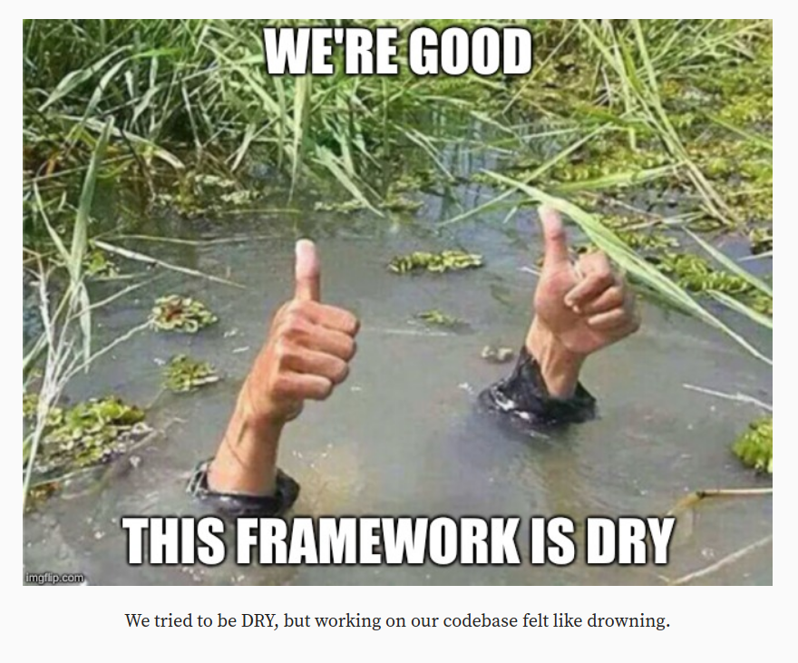

## Hugo Coder Adaptation

A free adaptation of the [Hugo Coder](https://github.com/luizdepra/hugo-coder) theme I use for my personal website ([larribas.me](https://larribas.me))

Some of the changes I included are:

* Blog posts include the date, reading time, alternative sites where it's published, and tags

* If published on alternative sites, blog posts include a message instructing readers to leave their comments on those sites (I didn't want multiple simultaneous comment streams)

* There's an "image" [shortcode](https://gohugo.io/content-management/shortcodes/) that will read images from the `resources` section in the front matter and render it together with a caption (if any), like so ``

* There's a "stackshare" [shortcode](https://gohugo.io/content-management/shortcodes/) that will embed a [stackshare](https://stackshare.io/) stack by ID, like so: ``

* Added an RSS template that renders the whole content of a post, allowing readers to read it fully from an RSS feed reader application, and linked to the RSS feed in the footer.

* Allowed emojis in multiple places, like the title or body of a piece of content, via Hugo's [emojify](https://gohugo.io/functions/emojify/) function.

### Disclaimers

I maintain this theme primarily for personal use. If you feel like you need a theme with wider adoption and maintenance, please check the upstream ([Hugo Coder](https://github.com/luizdepra/hugo-coder))

Both the upstream and Hugo have evolved a lot since I first created my site. Some of the changes mentioned above might not be the best practice anymore, or might be already included in the new versions of Hugo/Hugo Coder.

